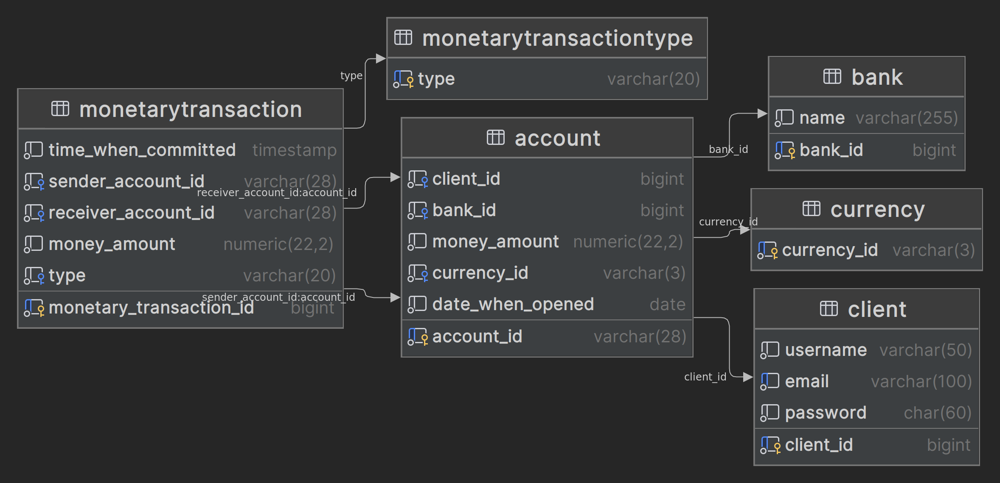

<h2 style="text-align: center">Консольное приложение Clever-Bank</h3>

Используемые технологии:

<ul>
<li>Java 17</li>
<li>JDBC api (Postgres JDBC driver)</li>
<li>Gradle</li>
<li>Lombok</li>
<li>JBcrypt by mindrot</li>
<li>PDFbox</li>
<li>snakeyaml</li>
<li>MapStruct</li>
<li>HikariCP</li>
<li>JUnit5</li>
<li>Mockito</li>
<li>AssertJ</li>
</ul>

Используемые паттерны:

<ul>
<li>Контекст (для внедрения зависимостей)</li>
<li>Синглтон (для доступа к контексту)</li>
<li>Декоратор (для распечатывания чеков)</li>
<li>Модель-вид-представление (для структурирования приложения
и разделения ответственности)</li>
<li>Объект для передачи данных (DTO) (для сокрытия определенной информации, и для внесения ясности насчёт того,
что проверка на корректность
относится именно к вводимым данным)</li>
<li>Слой взаимодействия с данными (DAO) (для создания интерфейса по взаимодействию с базой данных) </li>
<li>Хранилище соединений (Connection pool) (для получения доступа быстрого доступа к соединениям
и уменьшения нагрузки на приложение, связанной с созданием новых соединений, т.е.
переиспользование соединений)</li>
</ul>

<h3 style="text-align: center">Схема базы данных</h4>

База данных находится в 3-НФ. <a href="./database/3-NF">(Почему?)</a>

<h3>Как работает?</h3>
<ol>
<li>Выводится меню для аутентификации пользователя,
доступна регистрация. пароли шифруются алгоритмом BCrypt.</li>
<li>После прохождения аутентификации доступны варианты действий.
Например, можно создать новый счет и положить на него сумму денег, снять со своего счета определенную сумму или перевести
на другой счет с такой же валютой, в случае ошибки ввода будет выведено объяснение
почему транзакция не была завершена.</li>
<li>При успешном выполнении транзакций, в папку <strong>check</strong>, находящуюся в корне проекта, будут сохраняться соответствующие чеки.
(Этим занимается отдельный поток чтобы не блокировать приложение)</li>
<li>В папке <strong>yamlFiles</strong> находится файл, в соответствии с которым приложение
увеличивает денежную сумму(в отдельном потоке используя класс Timer) на указанном счете на указанный процент. (Увеличение происходит каждые 30 секунд, если
файл не соответствует правилам разметки YAML то увеличение не будет происходить до исправления)</li>
</ol>
<h3>Как запустить?</h3>

Прописать <code>docker compose run app</code>, находясь в корневой папке.
Необходимо, чтобы был установлен и запущен Docker.
